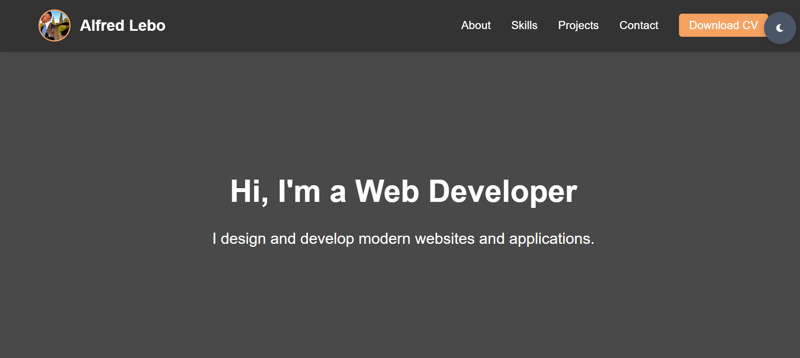

# Alfred Lebo's Dynamic Portfolio

**Live Demo:** [View Portfolio](https://allysto.github.io/portfolio-site/)  
 *Replace with actual screenshot path*

## ✨ Key Features
- **Fully Responsive Design**: Adapts seamlessly to mobile, tablet, and desktop
- **Interactive Project Gallery**: Showcases your work with demo links
- **Dark/Light Mode Toggle**: Customizable viewing experience
- **Contact Form**: Functional form for visitor inquiries
- **Skills Visualization**: Clean presentation of technical proficiencies

## 🛠 Technologies Used
- **Frontend**: HTML5, CSS3, JavaScript
- **Hosting**: GitHub Pages
- **Icons**: Font Awesome
- **Animations**: CSS Transitions

## 🚀 Project Highlights
1. **E-Commerce Demo**  
   - Frontend prototype with cart simulation  
  [Live Demo](https://allysto.github.io/ecommerce-site/)

2. **Job Application Tracker**  
   - Single-page application with analytics  
   [(https://github.com/allysto/Job-Application-Tracker)](https://allysto.github.io/Job-Application-Tracker/)

## 📌 How to Use
1. **Clone the repository**:
   ```bash
   git clone https://github.com/allysto/portfolio-site.git
